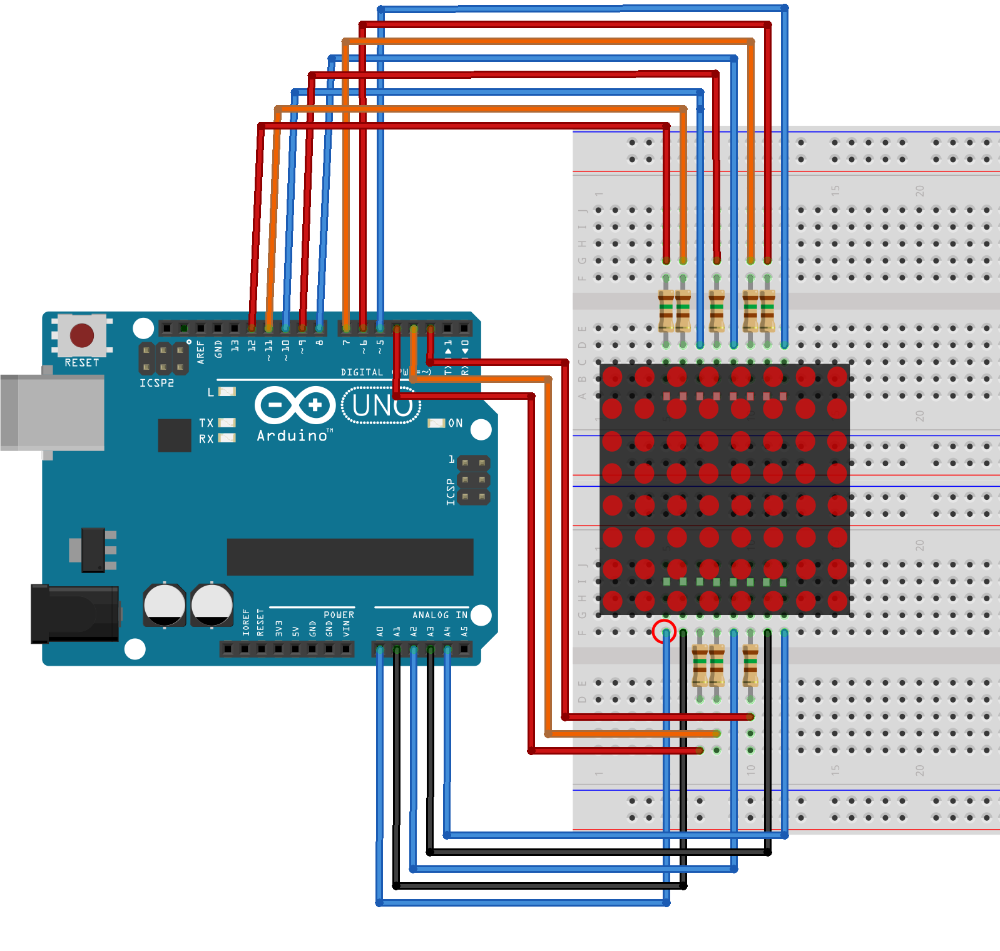

arduino.js × MatrixLED
=================
[arduino.js](http://mecha-mozilla.org/projects/arduino.js/)でドットマトリクスLEDを扱うサンプルです。
pin設定は[OSL641501-ARA](http://akizukidenshi.com/catalog/g/gI-05163/)を対象に書いてあります。

## 配線図

